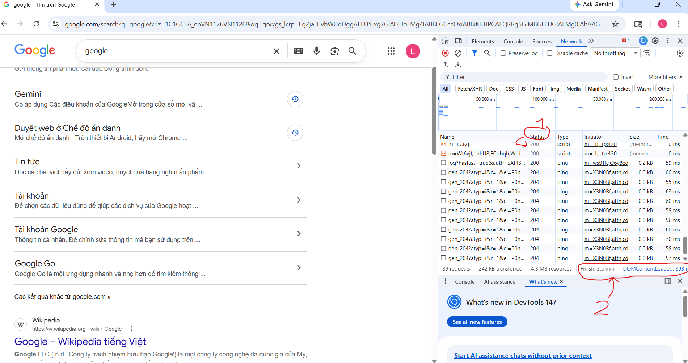
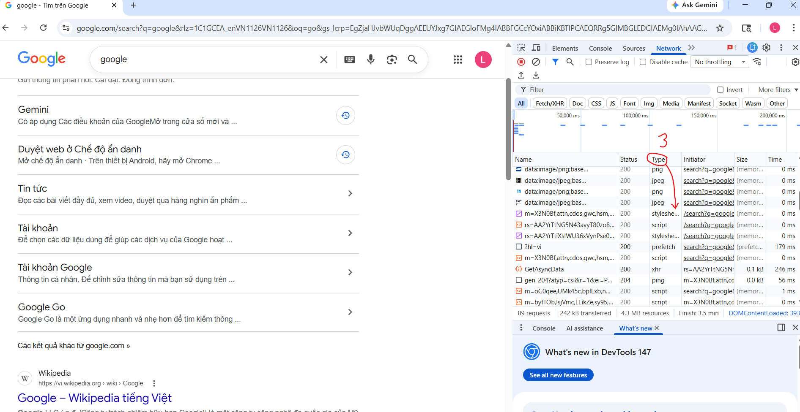
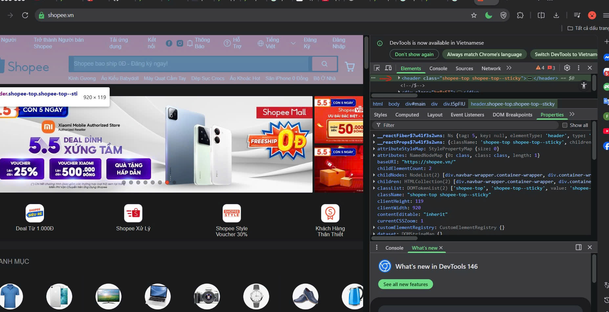
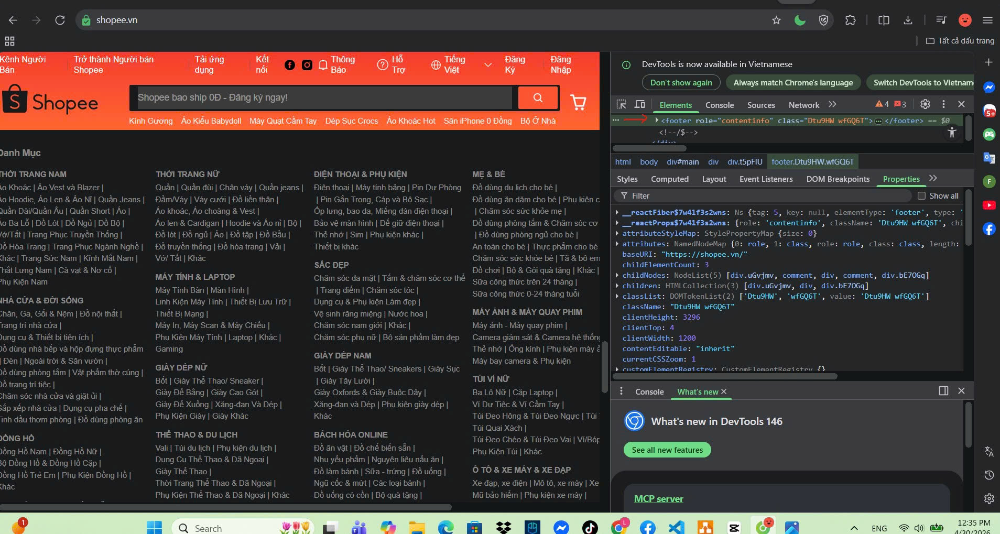
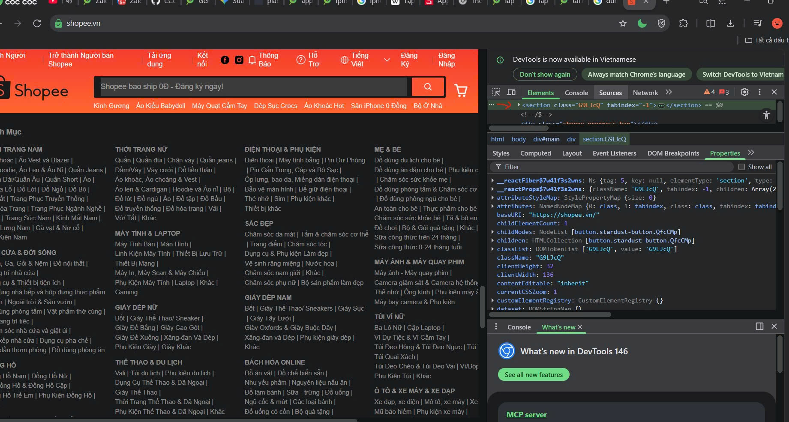

Câu A1:

1:

-Bước 1:Trình duyệt gửi yêu cầu đến DNS để tìm địa chỉ IP tương ứng với tên miền https://shopee.vn

-Bước 2:Khi có IP tương úng trình duyệt kết nối với máy chủ shopee

-Bước 3:Trình duyệt gửi yêu cầu đến máy chủ để lấy nội dung trang web

-Bước 4:Máy chủ shopee xử lý và gửi lại gói tin chứa mã nguồn html

-Bước 5:Trình duyệt đọc mã đó và hiển thị lên màn hình người dùng

(Phần Form trong file tài liệu của buổi 2,3)

2:

-Tab Network cho biết:

    + Các file đang được tải (HTML,CSS,..)

    + Trạng thái tải (thành công hay lỗi)

    + Kích thước các file (size)

    + Thời gian tải file

Câu A2:

-Việc trang web đó bị Google đánh giá SEO thấp là do lạm dụng quá nhiều thẻ 
.
-4 lỗi ngữ nghĩa được phát hiện ra:

    + 
 -> <header>: Xác định là phần đầu trang web.

    + 
 -> <nav>: Các liên kết điều hướng.

    + 
 -> <main>: Xác định là nội dung chính của trang.

    + 
 -> <footer>: Xác định phần chân trang.
        (Phần thẻ ngữ nghĩa)

Câu A3:
-Kết quả dự kiến:

    Hộp 1

    Text A Text B

    Hộp 2

    Text C Text D

    Hộp 3

-Giải thích:

    + Vì thẻ 

 là phần tử dạng khối nó là luôn bắt đầu trên một dòng mới và kéo dài hết toàn bộ chiều ngang có thể của trình duyệt nên "Hộp 1", "Hộp 2" và "Hộp 3", nội dung tiếp theo đều bị đẩy xuống dòng.

    + Vì thẻ  và <strong> là phần tử nội tuyến,chúng không bắt đầu trên dòng mới, chúng chỉ chiếm vừa đủ chiều rộng của nội dung bên trong và cho phép các phần tử nội tuyến khác nằm cùng hàng. Vì thế "Text A" nằm cạnh "Text B", và "Text C" nằm cạnh "Text D".

Câu A4:

Phân biệt các thẻ:

    - <thead>: phần đầu của bảng,chứa các tiêu đề của bảng.

    - <tbody>: phần thân của bảng,chứa nội dung chính của bảng.

    - <tfoot>: chứa phần tổng kết hoặc ghi chú ở cuối bảng.

3 lý do không nên dùng bảng để tạo trang web:

    - Không thân thiện: Khó tương thích trên điện thoại,các cột không tự sắp xếp được gây ức chế cho người dùng.

    - Tỉ lệ SEO thấp: Google khó hiểu cấu trúc nội dung của trang.

    - Tốc độ chậm: Mất nhiều thời gian để tính toán và hiển thị hơn.

Bài B3- Gỡ lỗi HTML
-Lỗi 1: Dòng 4 thẻ <title> chưa đóng -><title></title>

    -Lỗi 2: Dòng 8 thẻ <h1> đóng sai -> <h1></h1>

    -Lối 2: Dòng 12 đóng bằng <a> là sai -> </a>

    -Lỗi 3: Dòng 22 sai thứ tự thẻ 
<b>..
</b> -> 
<b>...</b>

    -Lỗi 4: Dòng 45 thẻ 
 chưa đóng -> 

    -Lỗi 5: Dòng 20 thiếu dấu ngoặc kếp của iphone.jpg -> "iphone.ipg"

    -Lỗi 6: Dòng 2 thiếu thuộc tính lang -> <html lang = "vi>

    -Lỗi 7: Dòng 40 và 42 trong 1 thẻ HTML chỉ có 1 main nên sửa thành <aside>...</aside>

    -Lỗi 8: Dòng 20 thẻ img thiếu thuộc tính alt -> 

    -Lỗi 9: Sau dòng 5 chưa có thẻ <meta name...> -> <meta name="viewport" content="width=device-width, initial-scale=1.0">

    -Lỗi 10: Dòng 4 và 5 bị đảo thứ tự đổi lại cho nhau

    -Lỗi 11: Dòng 9 và 10 bị lộn thứ tự đảo lại cho nhau

Bài B4:
1:

    -Thẻ <header> nằm trên dầu trang web chứa các logo,tiêu đề

    -Thẻ <footer> nằm ở dưới cùng trang web chứa các thông tin bản quyền

    -Thẻ <section> nằm ở thân trang web chứa nội dung trang

Câu C1:
''' html
<!DOCTYPE html>

<html lang="vi">
<head>
    <meta charset="UTF-8">
    <title>Chi tiết sản phẩm</title>
</head>
<body>

<!-- 1. Tiêu đề + Điều hướng: Dùng header để bao bọc phần đầu trang -->
<header>
        <h1>ShopTLU</h1> <!-- Tiêu đề chính của trang web -->
        <nav> <!-- nav vì đây là khu vực chứa các liên kết điều hướng chính -->
            <ul>
                <li><a href="#">Trang chủ</a></li>
                <li><a href="#">Sản phẩm</a></li>
            </ul>
        </nav>
    </header>

    <!-- 2. Breadcrumb: Dùng nav với aria-label để chỉ định đây là thanh điều hướng vị trí -->

<nav aria-label="breadcrumb">
    <ol> <!-- ol vì breadcrumb là danh sách có thứ tự/cấp bậc -->
        <li><a href="/">Trang chủ</a></li>
        <li><a href="/dien-thoai">Điện thoại</a></li>
        <li>iPhone 16</li>
    </ol>
</nav>

    <!-- Bao bọc nội dung chính của trang bằng thẻ main -->

<main>

        <!-- Dùng section để phân tách khu vực giới thiệu sản phẩm -->

<section class="product-essential">

            <!-- 3. Khu vực sản phẩm (5 ảnh): Dùng figure để chứa ảnh minh họa -->

<figure>
            
                <!-- Có thể dùng div hoặc span bọc các ảnh nhỏ phụ -->
            

                
                
                
                
            

</figure>

<!-- 4. Thông tin sản phẩm: Dùng article vì đây là nội dung độc lập về một mặt hàng -->
<article>
            <h2>iPhone 16 Pro Max</h2> <!-- Tên sản phẩm dùng h2 -->
            
29.990.000đ
 <!-- Giá tiền -->
            
⭐⭐⭐⭐⭐ (500 đánh giá)

            
Mô tả tóm tắt về hiệu năng và camera...

</article>
</section>

<!-- 5. Bảng thông số kỹ thuật: Dùng thẻ table cho dữ liệu dạng bảng -->
<section>
        <h3>Thông số kỹ thuật</h3>
        <table> <!-- table vì đây là dữ liệu so sánh/đối chiếu -->
        <thead> <!-- Phần tiêu đề của bảng -->
            <tr>
                    <th>Thuộc tính</th>
                    <th>Chi tiết</th>
            </tr>
        </thead>
        <tbody> <!-- Phần nội dung chính của bảng -->
            <tr>
                    <td>Màn hình</td>
                    <td>6.7 inch</td>
            </tr>
        </tbody>
        </table>
    </section>

<!-- 6. Khu vực đánh giá/bình luận: Dùng section riêng biệt -->
<section id="reviews">
            <h3>Đánh giá từ khách hàng</h3>
            <article> <!-- Mỗi bình luận là một nội dung độc lập nên dùng article -->
                <strong>Nguyễn Hữu Luân</strong>
                
Sản phẩm rất tốt, giao hàng nhanh!

            </article>
        </section>

</main>

<!-- 7. Sidebar: Dùng aside cho nội dung liên quan gián tiếp đến main -->
<aside>
        <h3>Sản phẩm tương tự</h3> <!-- Sidebar thường chứa gợi ý -->
        <ul>
            <li><a href="#">Samsung S24 Ultra</a></li>
            <li><a href="#">Xiaomi 14 Pro</a></li>
        </ul>
    </aside>

<!-- 8. Chân trang: Dùng footer -->
<footer>
        
&copy; 2026 ShopTLU - Địa chỉ: Hà Nội, Việt Nam
 <!-- footer chứa thông tin bản quyền/liên hệ -->
    </footer>

</body>
</html>
'''
